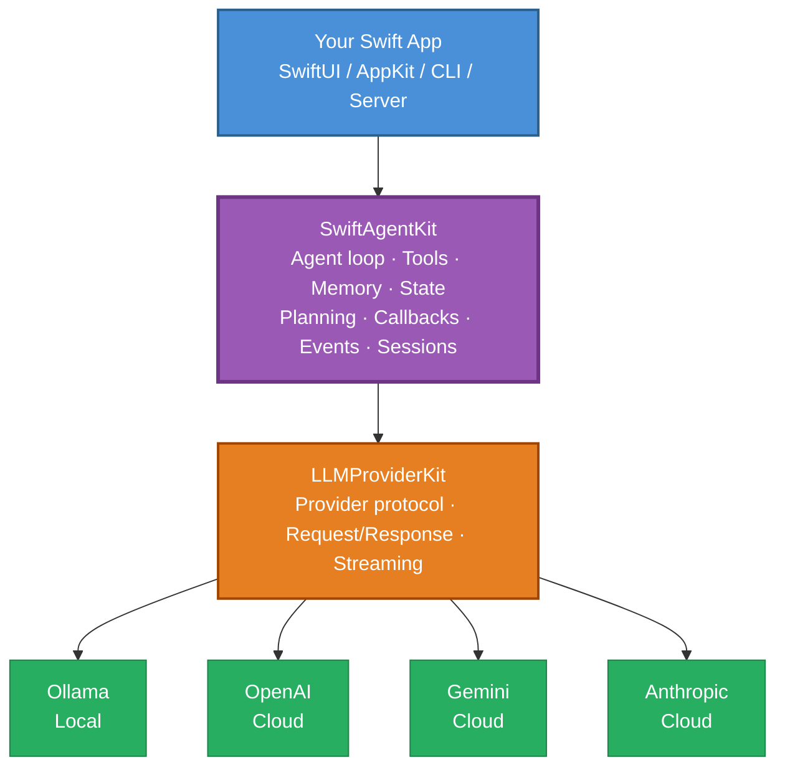

<p align="center">
  <h1 align="center">SwiftAgentKit</h1>
  <p align="center"><strong>Build AI agents in native Swift.</strong></p>
  <p align="center">Tools · Memory · Planning · Sessions · Callbacks · Events · Multi-provider</p>
  <p align="center">Powered by <a href="https://github.com/ayman3000/LLMProviderKit">LLMProviderKit</a></p>
</p>

<p align="center">
  
  
  
  
</p>

---

A modern AI agent framework for Swift. Native tool calling, conversation memory, planning, state, callbacks, session persistence, and a ReAct-style loop — all protocol-oriented, all Swift, zero UI dependencies. Designed for macOS/iOS apps, CLI agents, and local-first Ollama workflows. Works with **Ollama**, **OpenAI**, **Google Gemini**, and **Anthropic** through [LLMProviderKit](https://github.com/ayman3000/LLMProviderKit).

## See SwiftAgentKit in action

<video src="https://raw.githubusercontent.com/ayman3000/SwiftAgentKit/main/Media/SwiftAgentKitExplainer.mp4" controls width="100%"></video>

<p align="center">
  <a href="https://github.com/ayman3000/SwiftAgentKit/raw/main/Media/SwiftAgentKitExplainer.mp4"><strong>Watch or download the 74-second technical overview</strong></a>
</p>

---

## Table of Contents

- [30-Second Example](#30-second-example)
- [Features](#features)
- [Architecture](#architecture)
- [Quick Start](#quick-start)
- [Examples](#examples)
- [MCP Server Integration](#mcp-server-integration)
- [@Tool Macro (Optional)](#tool-macro-optional)
- [Design Principles](#design-principles)
- [Alpha Status](#alpha-status)
- [Contributing](#contributing)
- [License](#license)

---

## 30-Second Example

```swift
import SwiftAgentKit
import LLMProviderKit
import LLMProviderKitOllama

// 1. Pick any provider
let provider = OllamaProvider(configuration: .local(model: "llama3.2"))

// 2. Define a tool — any Swift struct conforming to AgentTool
struct CurrentTimeTool: AgentTool {
    let name = "current_time"
    let description = "Return the current date and time."
    let parameters = ToolParameters.empty

    func execute(context: ToolContext) async throws -> AgentToolResult {
        .success(toolCallId: context.callId, toolName: name,
                 result: Date().formatted(date: .complete, time: .standard))
    }
}

// 3. Create an agent — pass tools inline at init time
let agent = Agent(config: AgentConfig(
    provider: provider,
    systemPrompt: "You are a helpful assistant. Use tools when needed.",
    maxTurns: 6,
    tools: [CurrentTimeTool()]
))

// 4. Run — the model decides to call the tool, Swift executes it, results go back
let response = try await agent.run("What time is it? Use the tool.")
print(response)
```

That's a real agent — a tool-using loop where the model acts through your Swift code.

---

## Features

| Feature | Description |
|---|---|
| 🔧 **Tool system** | Define Swift tools with JSON-Schema parameters. Models call them natively. Parallel dispatch + dedup. |
| ✨ **@Tool macro** | Optional `@Tool` macro converts Swift functions to `AgentTool` structs — less boilerplate. |
| 🧠 **Conversation memory** | Token-aware history that trims to fit the context window automatically. |
| 🧠 **Persistent memory store** | Markdown-based long-term memory the agent can read and write across sessions. |
| 🎯 **Goal tracking** | Track user requests as persistent goals with status and progress. |
| 📋 **Planning** | Optional planning step before execution for complex multi-step tasks. |
| 🔄 **Repair retry** | Nudges the model when tools fail instead of accepting false success. |
| 📊 **Plan continuation** | Nudges the model if it stops before completing a plan. |
| 🗂️ **Agent state** | Cross-turn key-value store with `{key}` prompt templating. |
| 📡 **Lifecycle callbacks** | 8 intercept-able hooks: beforeAgent, afterAgent, beforeModel, afterModel, beforeTool, afterTool, onModelError, onToolError. |
| 📡 **Event stream** | Observe starts, LLM calls, tool calls, tool results, retries, finish summaries. |
| 💾 **Session persistence** | Save/restore conversations via `SessionStore` protocol + `FileSessionStore`. |
| 📝 **Structured output** | Tolerant JSON extraction from imperfect model responses. |
| 🎯 **Progressive disclosure skills** | Inject domain instructions only when query keywords match — keeps prompts small for local models. |
| 🌊 **Streaming** | Token-by-token streaming for non-tool responses. |
| 🖥️ **Local LLMs** | Full Ollama support — run agents entirely offline. |
| ☁️ **Cloud providers** | OpenAI, Gemini, Anthropic — swap providers, keep everything else. |
| ⚡ **Async/await** | Native Swift concurrency throughout. No completion handlers. |
| 🔒 **Cancellation** | Cooperative cancellation between turns. |

### Provider support

| Provider | Tool calling | Streaming | Model discovery |
|---|---|---|---|
| **Ollama** | ✅ Native `tools` | ✅ | ✅ `GET /api/tags` |
| **OpenAI** | ✅ Native `tools` + `tool_choice` | ✅ | ✅ `GET /v1/models` |
| **Gemini** | ✅ `functionDeclarations` | ✅ | ✅ `GET /v1beta/models` |
| **Anthropic** | ✅ `tool_use` content blocks | ✅ | ✅ Curated list |

---

## Architecture

### Two-layer stack



SwiftAgentKit does **not** implement provider networking itself. It depends on `LLMProviderKit`'s `LLMProvider` protocol, so the same agent can run on local or cloud models.

### Agent loop

On each `run()` call the agent appends the user message, optionally generates a plan, then enters a ReAct loop: it sends the conversation + tool definitions to the model, parses any tool calls, executes them in Swift (parallel, deduplicated, ID-stamped), feeds results back, and repeats until the model returns a final answer or `maxTurns` is reached. Callbacks and events fire at every stage; repair-retry and plan-continuation nudge the model back on track when needed.

### Package layout

```
Sources/SwiftAgentKit/
├── Core/
│   ├── Agent.swift              # AgentConfig + main Agent runtime
│   ├── AgentMessage.swift       # Messages, tool calls, tool results
│   ├── AgentState.swift         # Cross-turn key-value state + {key} templating
│   ├── AgentCallbacks.swift     # 8 intercept-able lifecycle hooks
│   ├── AgentSkill.swift         # Progressive-disclosure skills
│   ├── AgentEvent.swift         # Event stream + run summaries
│   ├── AgentError.swift         # Typed errors
│   └── AgentLLMResponse.swift   # Provider response bridge
├── Tools/
│   ├── AgentTool.swift          # Tool protocol + JSON-Schema params
│   ├── ToolContext.swift        # Rich context (state, call info, actions)
│   └── ToolDispatcher.swift     # Parallel dispatch, dedup, confirmation
├── Memory/
│   ├── Conversation.swift       # Token-aware conversation history
│   ├── SessionStore.swift      # Session persistence protocol + file store
│   ├── AgentMemoryStore.swift   # Long-term memory store protocol + file-backed impl
│   └── RememberTool.swift       # Built-in tool for agents to persist memory
├── Planning/
│   ├── AgentPlan.swift          # Plan model + LLMPlanner
│   ├── AgentGoal.swift          # Goal model + goal store persistence
│   └── RepairRetryPolicy.swift  # Repair-retry + plan continuation
├── StructuredOutput/
│   └── StructuredOutput.swift   # Tolerant JSON extraction
├── Logging/
│   └── AgentLogger.swift        # Lightweight logger
Sources/SwiftAgentKitMCP/
├── MCPClientConfig.swift        # stdio/HTTP connection config
├── MCPToolBridge.swift          # MCP Tool → AgentTool bridge
└── MCPManager.swift             # Connection lifecycle + tool discovery
```

---

## Quick Start

### Installation

**Xcode:** File ▸ Add Package Dependencies → add `https://github.com/ayman3000/SwiftAgentKit` and `https://github.com/ayman3000/LLMProviderKit`

**Package.swift:**

```swift
.dependencies: [
    .package(url: "https://github.com/ayman3000/SwiftAgentKit.git", from: "0.3.0-alpha.1"),
    .package(url: "https://github.com/ayman3000/LLMProviderKit.git", from: "0.1.0-alpha.1"),
],
targets: [
    .target(name: "YourApp", dependencies: [
        .product(name: "SwiftAgentKit", package: "SwiftAgentKit"),
        .product(name: "LLMProviderKit", package: "LLMProviderKit"),
        .product(name: "LLMProviderKitOllama", package: "LLMProviderKit"),
        // Add the providers you need:
        // .product(name: "LLMProviderKitOpenAI", package: "LLMProviderKit"),
        // .product(name: "LLMProviderKitGemini", package: "LLMProviderKit"),
        // .product(name: "LLMProviderKitAnthropic", package: "LLMProviderKit"),
    ])
]
```

### First agent

```swift
import SwiftAgentKit
import LLMProviderKit
import LLMProviderKitOllama

let provider = OllamaProvider(configuration: .local(model: "llama3.2"))

let agent = Agent(config: AgentConfig(
    provider: provider,
    systemPrompt: "You are a helpful Swift assistant.",
    maxTurns: 1
))

let answer = try await agent.run("Explain async/await in one sentence.")
print(answer)
```

### First tool

```swift
struct EchoTool: AgentTool {
    let name = "echo"
    let description = "Echo a message back."
    let parameters = ToolParameters(
        properties: ["message": ToolParameterProperty(type: "string", description: "Message to echo")],
        required: ["message"]
    )

    func execute(context: ToolContext) async throws -> AgentToolResult {
        let msg = context.parameters["message"] as? String ?? ""
        return .success(toolCallId: context.callId, toolName: name, result: "Echo: \(msg)")
    }
}

let agent = Agent(config: AgentConfig(
    provider: provider,
    maxTurns: 6,
    tools: [EchoTool()]
))
let response = try await agent.run("Echo the message 'Hello from SwiftAgentKit!'")
```

---

## Examples

### Tool calling

```swift
struct CurrentTimeTool: AgentTool {
    let name = "current_time"
    let description = "Return the current date and time."
    let parameters = ToolParameters.empty

    func execute(context: ToolContext) async throws -> AgentToolResult {
        .success(toolCallId: context.callId, toolName: name,
                 result: Date().formatted(date: .complete, time: .standard))
    }
}

let agent = Agent(config: AgentConfig(
    provider: provider,
    systemPrompt: "You are a helpful assistant. Use tools when needed.",
    maxTurns: 6
))
agent.register(CurrentTimeTool())

let response = try await agent.run("What time is it? Use the tool.")
```

### Multiple tools with parallel dispatch

```swift
struct CalculatorTool: AgentTool {
    let name = "calculator"
    let description = "Calculate a basic arithmetic expression."
    let parameters = ToolParameters(
        properties: ["expression": ToolParameterProperty(type: "string", description: "e.g. 38 * 17")],
        required: ["expression"]
    )

    func execute(context: ToolContext) async throws -> AgentToolResult {
        let expr = context.parameters["expression"] as? String ?? ""
        // Replace with a real safe parser in production
        if expr.trimmingCharacters(in: .whitespaces) == "38 * 17" {
            return .success(toolCallId: context.callId, toolName: name, result: "646")
        }
        return .error(toolCallId: context.callId, toolName: name, message: "Unsupported expression.")
    }
}

agent.registerAll([CurrentTimeTool(), EchoTool(), CalculatorTool()])
let result = try await agent.run("Get the time, echo 'hello', then calculate 38 * 17.")
```

When the model requests multiple tools in one turn, SwiftAgentKit dispatches them concurrently and preserves order when feeding results back.

### Persistent memory

SwiftAgentKit supports long-term, cross-session memory. The app chooses where memory lives — the library never hardcodes a folder name.

```swift
import Foundation
import SwiftAgentKit

// App names the folder; SwiftAgentKit provides a convenience helper
let store = FileAgentMemoryStore.defaultStore(named: "myapp")

// Or use any explicit directory URL
// let store = FileAgentMemoryStore(directory: fileURL)

let agent = Agent(config: AgentConfig(
    provider: provider,
    systemPrompt: "You are a helpful assistant. Remember user facts across sessions.",
    maxTurns: 6
))

// Attaching a memory store:
// 1. Injects the memory context block into the system prompt
// 2. Auto-registers the built-in `remember` tool
agent.memoryStore = store
```

The file-backed store uses a markdown layout similar to production agent patterns:

```
~/.myapp/
├── AGENT.md          # Agent identity / instructions
├── USER.md           # User profile
├── MEMORY.md         # Index / summary of facts
└── memory/
    ├── fact-001.md   # Individual fact
    └── fact-002.md
```

### Goal tracking

Track user requests as persistent goals. Enable tracking on any `run(_:)` call and the agent saves the goal with final status and a summary.

```swift
let goalStore = FileAgentGoalStore(directory: someDirectoryURL)
agent.goalStore = goalStore

let answer = try await agent.run("Analyze this project and write a README summary.", trackGoal: true)

// Later, inspect or resume goals
let goals = try await goalStore.loadAll()
for goal in goals {
    print(goal.status, goal.query, goal.summary ?? "")
}
```

Goals carry status (`pending`, `inProgress`, `completed`, `failed`, `abandoned`), a progress percentage derived from the active plan, and a final summary once the run finishes.

### Streaming

```swift
// Simple non-tool responses — token by token
for try await chunk in agent.stream("Tell me a short story about Swift actors.") {
    print(chunk, terminator: "")
}

// Tool-using agents — runs the loop, then streams the final response
for try await chunk in agent.runStreaming("Use tools, then summarize.") {
    print(chunk, terminator: "")
}
```

> The tool loop is non-streaming internally because tool calls need complete model responses. `runStreaming` is a convenience API: when no tools are registered it delegates to `stream(_:)`; when tools are registered it runs the ReAct loop first, then emits the final answer. Do not rely on it for live token-by-token visibility during tool execution.

### Event monitoring

```swift
agent.onEvent { event in
    switch event {
    case .started(let query):
        print("Started:", query)
    case .llmCallStarted(let turn):
        print("LLM call — turn \(turn)")
    case .toolCallsReceived(let calls):
        print("Tools:", calls.map(\.name).joined(separator: ", "))
    case .toolExecutionFinished(let call, let result):
        print("✓ \(call.name): \(result.isError ? "ERROR" : "OK")")
    case .finished(let summary):
        print("Done: \(summary.totalTurns) turns, \(summary.toolsExecuted) tools, \(String(format: "%.1f", summary.elapsed))s")
    default: break
    }
}
```

Perfect for debug panels, progress UIs, and audit logs.

### Callbacks + guardrails

```swift
var callbacks = AgentCallbacks()

// Block destructive requests
callbacks.beforeAgent = { query, state in
    query.lowercased().contains("delete everything")
        ? "I can't perform destructive actions without confirmation."
        : nil
}

// Block dangerous tools
callbacks.beforeTool = { call, context in
    call.name == "delete_file"
        ? .error(toolCallId: call.id, toolName: call.name, message: "Blocked by policy.")
        : nil
}

// Post-process responses
callbacks.afterAgent = { response, state in
    response.trimmingCharacters(in: .whitespacesAndNewlines)
}

agent.callbacks = callbacks
```

### Planning

```swift
let agent = Agent(config: AgentConfig(
    provider: provider,
    systemPrompt: "You are a systematic implementation assistant.",
    maxTurns: 12,
    enablePlanning: true,
    enablePlanContinuation: true,
    enableRepairRetry: true
))

agent.registerAll([ReadFileTool(), WriteFileTool(), ListFilesTool()])
let result = try await agent.run("Inspect this project and write a README summary.")
```

Planning is optional. Keep it off for simple tasks; enable it for multi-step workflows.

---

## MCP Server Integration

SwiftAgentKit can connect to any [Model Context Protocol](https://modelcontextprotocol.io) server and use its tools as native `AgentTool`s. This gives your agents instant access to the growing MCP ecosystem — filesystem, GitHub, databases, browser automation, and more — without writing tools in Swift.

MCP support is an **optional product** (`SwiftAgentKitMCP`) so it doesn't add weight to the core library.

### Installation

Add `SwiftAgentKitMCP` to your dependencies:

```swift
.dependencies: [
    .package(url: "https://github.com/ayman3000/SwiftAgentKit.git", from: "0.3.0-alpha.1"),
    .package(url: "https://github.com/ayman3000/LLMProviderKit.git", from: "0.1.0-alpha.1"),
],
targets: [
    .target(name: "YourApp", dependencies: [
        .product(name: "SwiftAgentKit", package: "SwiftAgentKit"),
        .product(name: "SwiftAgentKitMCP", package: "SwiftAgentKit"),
        .product(name: "LLMProviderKitOllama", package: "LLMProviderKit"),
    ])
]
```

### Usage

```swift
import SwiftAgentKit
import SwiftAgentKitMCP
import LLMProviderKitOllama

let agent = Agent(config: AgentConfig(
    provider: OllamaProvider(configuration: OllamaProvider.local(model: "llama3.2")),
    systemPrompt: "You are a helpful assistant with filesystem tools.",
    maxTurns: 10
))

// Connect to MCP servers — tools are auto-discovered and bridged
let mcp = MCPManager()
try await mcp.connect(.stdio(command: "npx", args: ["-y", "@modelcontextprotocol/server-filesystem", "/tmp"]))
try await mcp.connect(.http(endpoint: URL(string: "http://localhost:8080")!))

// Bridge all MCP tools into the agent
for tool in try await mcp.bridgedTools() {
    agent.register(tool)
}

// Run — the agent can now use filesystem tools
let response = try await agent.run("List the files in /tmp and summarize what's there.")
print(response)

// Clean up when done
await mcp.disconnectAll()
```

### What's supported

- **Stdio transport** — connect to local MCP servers via subprocess
- **HTTP transport** — connect to remote MCP servers
- **Tool discovery** — `listTools()` → `AgentTool` bridge (name, description, schema, execution)
- **Resource discovery** — `listResources()` → `MCPResourceInfo`, `readResource(uri:)`, `resourcesContextBlock()`
- **Multi-server** — connect to multiple MCP servers simultaneously; all tools and resources merge

### What's not yet supported

- MCP prompts, completions, sampling, elicitation — tools and resources only for now
- MCP server hosting (SwiftAgentKit is a client, not a server)

---

## @Tool Macro (Optional)

Use the `@Tool` macro to convert any Swift function into an `AgentTool` with less boilerplate:

```swift
import SwiftAgentKit

struct MyTools {
    @Tool("Return the current date and time.")
    func currentTime() async throws -> String {
        Date().formatted(date: .complete, time: .standard)
    }

    @Tool("Calculate a basic arithmetic expression.")
    func calculator(expression: String) async throws -> String {
        "646"
    }
}

let tools = MyTools()
let agent = Agent(config: AgentConfig(
    provider: provider,
    maxTurns: 6,
    tools: [tools.currentTimeTool(), tools.calculatorTool()]
))
```

The macro generates an `AgentTool`-conforming struct with a snake_case name, JSON-Schema parameters from the function signature (String, Int, Double, Bool), result wrapping with `context.callId`, and a `funcNameTool()` factory that captures `self`.

Current alpha limitations: parameters are generated as required; only primitive types are supported (use manual `AgentTool` for arrays, nested objects, or enums); grouped `- Parameters:` DocC blocks aren't fully parsed yet. The `AgentTool` protocol remains the primary API — the macro is optional.

---

## Design Principles

1. **Native Swift first.** Built for Swift developers who want agents in their apps — not a port or a wrapper. Protocol-oriented, async/await throughout, zero UI dependencies.
2. **Minimal dependencies.** SwiftAgentKit is Foundation-only; LLMProviderKit is the sole dependency. Local-first capable with Ollama as a first-class provider.
3. **Composable.** Use what you need — tools without planning, memory without sessions, state without skills. Every feature is independent.
4. **Provider-agnostic.** Swap Ollama for OpenAI, Gemini, or Anthropic; the agent code doesn't change. Everything (`AgentTool`, `LLMProvider`, `SessionStore`, `AgentPlanner`) is a protocol.

---

## Alpha Status

**Known alpha limitations:**
- Public APIs may change before beta
- Provider behavior varies by model quality — some models ignore tools even when available
- `stream(_:)` is token-by-token for simple non-tool paths; `runStreaming(_:)` does not stream intermediate tool-loop tokens
- One `Agent` instance is intended for one active `run(_:)` at a time
- The `@Tool` macro is best for primitive required parameters; use manual `AgentTool` definitions for complex schemas

Feedback from real Swift apps is very welcome.

**Build and test:**

```bash
swift build
swift test
```

82 unit tests (74 core + 8 MCP), no network calls.

---

## Contributing

Issues, pull requests, and feedback are all welcome.

- 🐛 [Open an issue](https://github.com/ayman3000/SwiftAgentKit/issues)
- 🔀 [Submit a pull request](https://github.com/ayman3000/SwiftAgentKit/pulls)

---

## License

MIT