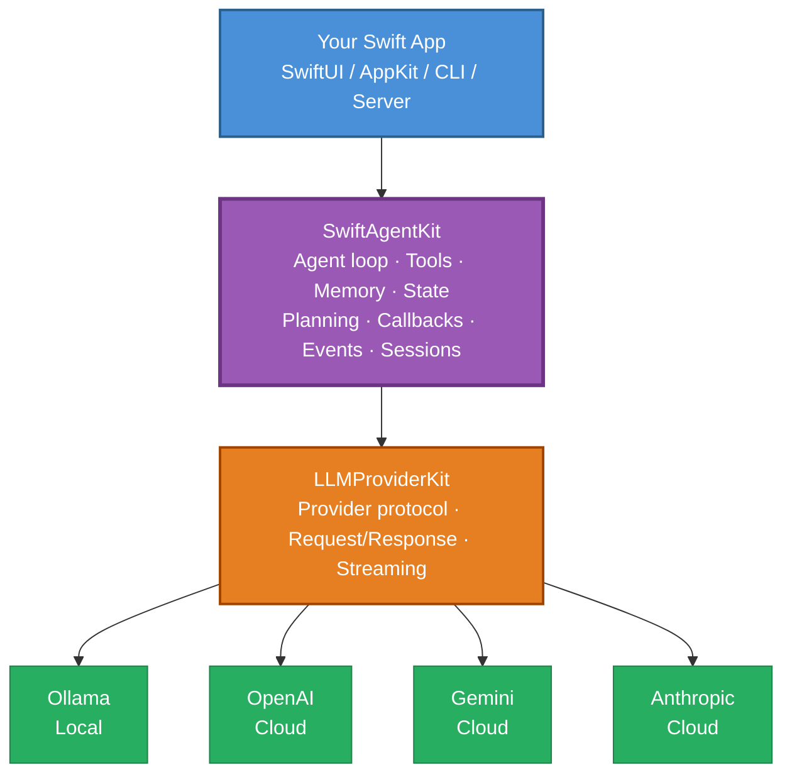
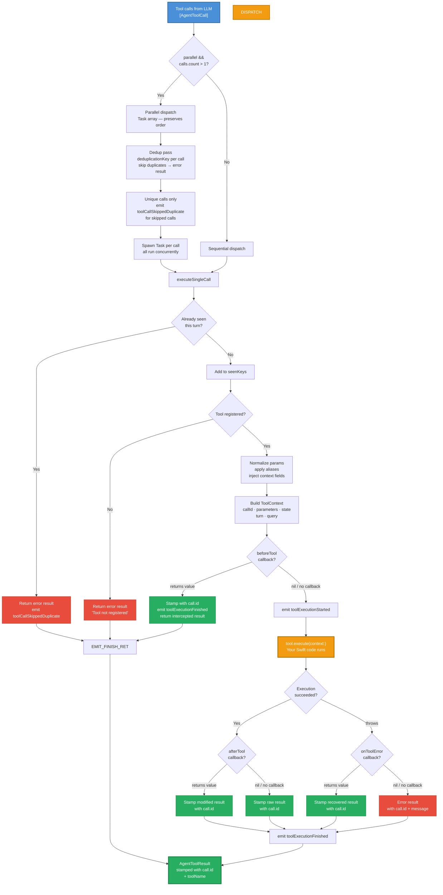
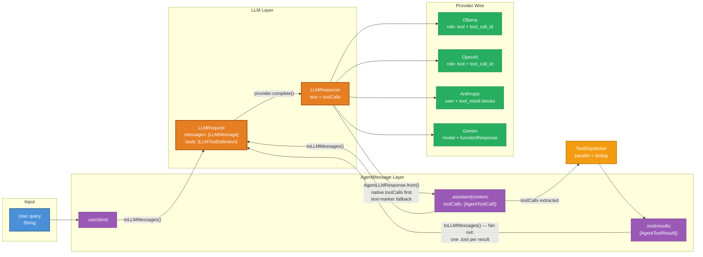
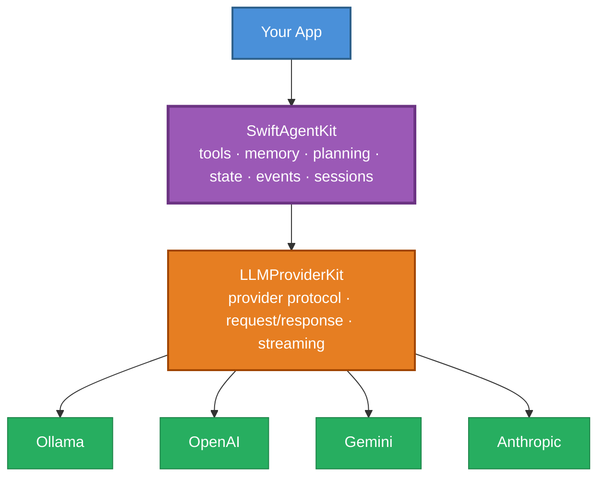

<p align="center">
  <h1 align="center">SwiftAgentKit</h1>
  <p align="center"><strong>Build AI agents in native Swift.</strong></p>
  <p align="center">Tools · Memory · Planning · Sessions · Callbacks · Events · Multi-provider</p>
  <p align="center">Powered by <a href="https://github.com/ayman3000/LLMProviderKit">LLMProviderKit</a></p>
</p>

<p align="center">
  
  
  
  
</p>

---

> **LLMProviderKit talks to models. SwiftAgentKit lets models act.**

A modern AI agent framework built specifically for Swift developers. Native tool calling, conversation memory, planning, state, callbacks, session persistence, and a ReAct-style loop — all protocol-oriented, all Swift, zero UI dependencies.

Works with **Ollama**, **OpenAI**, **Google Gemini**, and **Anthropic** through [LLMProviderKit](https://github.com/ayman3000/LLMProviderKit).

---

## Table of Contents

- [Who is this for?](#who-is-this-for)
- [Why SwiftAgentKit?](#why-swiftagentkit)
- [30-Second Example](#30-second-example)
- [Features](#features)
- [Architecture](#architecture)
- [SwiftAgentKit + LLMProviderKit](#swiftagentkit--llmproviderkit)
- [Quick Start](#quick-start)
- [Examples](#examples)
- [Comparison](#comparison)
- [Design Principles](#design-principles)
- [Roadmap](#roadmap)
- [Why Another Agent Framework?](#why-another-agent-framework)
- [Contributing](#contributing)
- [Support](#support)
- [License](#license)

---

## Who is this for?

SwiftAgentKit is for developers building:

- **macOS AI assistants** — file managers, code tools, automation utilities
- **iOS AI applications** — on-device assistants, chat apps, productivity tools
- **Swift CLI agents** — command-line tools that need LLM reasoning + tool execution
- **Local Ollama-powered tools** — offline-first agents with zero cloud dependency
- **AI features inside existing Apple apps** — copilots, smart search, guided workflows
- **Multi-step AI workflows** — plan → execute → verify → iterate
- **Cross-provider agents** — prototype on Ollama, ship on OpenAI/Anthropic/Gemini

If you're a Swift developer who wants models to *do things* in your app — not just generate text — SwiftAgentKit is built for you.

---

## Why SwiftAgentKit?

Python has LangGraph, Google ADK, OpenAI Agents SDK, PydanticAI — dozens of mature agent frameworks.

**Swift's AI ecosystem still lacks mature native agent frameworks.** Existing Swift AI libraries are mostly thin OpenAI wrappers — they talk to models, but they don't let models *act* — no tool loop, no memory, no planning, no state, no sessions.

SwiftAgentKit fills that gap:

| The problem | The solution |
|---|---|
| Calling an LLM ≠ building an agent | A full agent loop: model → tools → results → model, until done |
| Python frameworks can't run in Swift apps | Pure Swift, protocol-oriented, async/await, zero UI deps |
| OpenAI-only wrappers lock you in | Any provider: Ollama, OpenAI, Gemini, Anthropic — swap with one line |
| No memory between turns | Token-aware conversation history with automatic trimming |
| No way to share state across tools | `AgentState` — cross-turn KV store with `{key}` prompt templating |
| No multi-step task support | Optional planner + plan continuation + repair-retry |

---

## 30-Second Example

```swift
import SwiftAgentKit
import LLMProviderKit
import LLMProviderKitOllama

// 1. Pick any provider
let provider = OllamaProvider(configuration: .local(model: "llama3.2"))

// 2. Create an agent with tools
let agent = Agent(config: AgentConfig(
    provider: provider,
    systemPrompt: "You are a helpful assistant. Use tools when needed.",
    maxTurns: 6
))

// 3. Define a tool — any Swift struct conforming to AgentTool
struct CurrentTimeTool: AgentTool {
    let name = "current_time"
    let description = "Return the current date and time."
    let parameters = ToolParameters.empty

    func execute(parameters: [String: Any]) async throws -> AgentToolResult {
        .success(toolCallId: "", toolName: name,
                 result: Date().formatted(date: .complete, time: .standard))
    }
}

agent.register(CurrentTimeTool())

// 4. Run — the model decides to call the tool, Swift executes it, results go back
let response = try await agent.run("What time is it? Use the tool.")
print(response)
```

That's a real agent. Not a chat wrapper — a tool-using loop where the model acts through your Swift code.

### Quick Demo

Here's what happens when you call `agent.run("What time is it? Use the tool.")`:

```
┌─────────────────────────────────────────────────────────┐
│  agent.run("What time is it? Use the tool.")            │
└──────────────────────┬──────────────────────────────────┘
                       │
                       ▼
┌─────────────────────────────────────────────────────────┐
│  Turn 1                                                  │
│  → Send query + tool definitions to LLM                 │
│  ← LLM responds: tool_calls: [current_time()]            │
│  → Swift executes CurrentTimeTool()                     │
│  ← Result: "Sunday, June 29, 2024 at 2:15 PM"           │
│  → Send tool result back to LLM                         │
│  ← LLM responds: "The current time is 2:15 PM."         │
│  → Done — no more tool calls                            │
└─────────────────────────────────────────────────────────┘

Final response: "The current time is 2:15 PM."
  Turns: 1  ·  Tools executed: 1  ·  Errors: 0
```

---

## Features

| Feature | Description |
|---|---|
| 🔧 **Tool system** | Define Swift tools with JSON-Schema parameters. Models call them natively. Parallel dispatch + dedup. |
| 🧠 **Conversation memory** | Token-aware history that trims to fit the context window automatically. |
| 📋 **Planning** | Optional planning step before execution for complex multi-step tasks. |
| 🔄 **Repair retry** | Nudges the model when tools fail instead of accepting false success. |
| 📊 **Plan continuation** | Nudges the model if it stops before completing a plan. |
| 🗂️ **Agent state** | Cross-turn key-value store with `{key}` prompt templating. |
| 📡 **Lifecycle callbacks** | 8 intercept-able hooks: beforeAgent, afterAgent, beforeModel, afterModel, beforeTool, afterTool, onModelError, onToolError. |
| 📡 **Event stream** | Observe starts, LLM calls, tool calls, tool results, retries, finish summaries. |
| 💾 **Session persistence** | Save/restore conversations via `SessionStore` protocol + `FileSessionStore`. |
| 📝 **Structured output** | Tolerant JSON extraction from imperfect model responses. |
| 🎯 **Progressive disclosure skills** | Inject domain instructions only when query keywords match — keeps prompts small for local models. |
| 🌊 **Streaming** | Token-by-token streaming for non-tool responses. |
| 🖥️ **Local LLMs** | Full Ollama support — run agents entirely offline. |
| ☁️ **Cloud providers** | OpenAI, Gemini, Anthropic — swap providers, keep everything else. |
| ⚡ **Async/await** | Native Swift concurrency throughout. No completion handlers. |
| 🔒 **Cancellation** | Cooperative cancellation between turns. |

### Provider support

| Provider | Tool calling | Streaming | Model discovery |
|---|---|---|---|
| **Ollama** | ✅ Native `tools` | ✅ | ✅ `GET /api/tags` |
| **OpenAI** | ✅ Native `tools` + `tool_choice` | ✅ | ✅ `GET /v1/models` |
| **Gemini** | ✅ `functionDeclarations` | ✅ | ✅ `GET /v1beta/models` |
| **Anthropic** | ✅ `tool_use` content blocks | ✅ | ✅ Curated list |

---

## Architecture

### How it works in 10 seconds

```
User Query ──→ SwiftAgentKit ──→ LLMProviderKit ──→ LLM Provider
                   │                                      │
                   │                              Model decides:
                   │                              "I need to call a tool"
                   │                                      │
                   │  ◀──────── tool_calls ────────────────┘
                   │
              Swift executes tools
              (your code runs)
                   │
                   │  ──→ tool results sent back to model
                   │
                   │  ◀──────── final answer ──────────────
                   │
              Return response
```

**That's the entire concept.** The model thinks, your Swift code acts, results go back, the model finishes.

The diagrams below show the engineering details.

**Color legend for all diagrams:**

| Color | Meaning |
|---|---|
| 🔵 Blue | User input / your app |
| 🟣 Purple | SwiftAgentKit internals |
| 🟠 Orange | LLMProviderKit / LLM calls |
| 🟡 Yellow | Tool execution (your Swift code) |
| 🟢 Green | Successful output / providers |
| 🔴 Red | Error handling |
| ⚪ Gray | Edge cases / short-circuits |

### Two-layer stack



SwiftAgentKit does **not** implement provider networking itself. It depends on `LLMProviderKit`'s `LLMProvider` protocol, so the same agent can run on local or cloud models.

### Agent ReAct loop

The complete decision tree the agent follows on every `run()` call. **Follow the green path for the happy path** — blue is input, purple is SwiftAgentKit internals, yellow is tool execution, red is error handling:

```mermaid
flowchart TD
    START(("agent.run(query)"))
    START --> BEFORE_AGENT{"beforeAgent<br/>callback?"}
    BEFORE_AGENT -- "returns value" --> SHORT_CIRCUIT["Return intercepted<br/>response immediately"]
    BEFORE_AGENT -- "nil / no callback" --> ADD_USER["Append user message<br/>to conversation"]

    ADD_USER --> TOOLS["Get registered tools<br/>strengthen system prompt<br/>'You MUST use tools...'"]
    TOOLS --> SKILLS{"Query matches<br/>skill keywords?"}
    SKILLS -- "Yes" --> INJECT_SKILLS["Inject matching skill<br/>instructions into prompt"]
    SKILLS -- "No" --> PLAN_CHECK
    INJECT_SKILLS --> PLAN_CHECK{"Planning enabled?<br/>planner.shouldPlan()"}
    PLAN_CHECK -- "Yes" --> PLAN["Generate plan via LLM<br/>emit planGenerated<br/>add plan to conversation"]
    PLAN_CHECK -- "No" --> LOOP_ENTRY

    PLAN --> LOOP_ENTRY{{"Agent Loop — turn N"}}
    LOOP_ENTRY --> CANCEL{"Cancelled?"}
    CANCEL -- "Yes" --> CANCELLED["throw AgentError.cancelled"]
    CANCEL -- "No" --> TRIM["Get messages<br/>trim to context window<br/>emit historyTrimmed if needed"]

    TRIM --> LLM_START["emit llmCallStarted"]
    LLM_START --> BEFORE_MODEL{"beforeModel<br/>callback?"}
    BEFORE_MODEL -- "returns value" --> USE_INTERCEPT["Use intercepted response"]
    BEFORE_MODEL -- "nil / no callback" --> BUILD_REQ["Build LLMRequest<br/>state-templated system prompt<br/>+ tool definitions"]
    USE_INTERCEPT --> HAS_TOOLS_1

    BUILD_REQ --> CALL_LLM["provider.complete(request)"]
    CALL_LLM --> LLM_ERROR{"LLM call<br/>failed?"}
    LLM_ERROR -- "Yes" --> ON_MODEL_ERROR{"onModelError<br/>callback?"}
    ON_MODEL_ERROR -- "returns fallback" --> USE_FALLBACK["Use fallback response"]
    ON_MODEL_ERROR -- "nil / no callback" --> THROW_PROVIDER["throw AgentError.providerError"]
    USE_FALLBACK --> HAS_TOOLS_1{"Response has<br/>tool calls?"}
    LLM_ERROR -- "No" --> PARSE["AgentLLMResponse.from(response)<br/>native toolCalls first,<br/>text-marker fallback"]
    PARSE --> AFTER_MODEL{"afterModel<br/>callback?"}
    AFTER_MODEL -- "returns value" --> MODIFIED["Use modified response"]
    AFTER_MODEL -- "nil / no callback" --> HAS_TOOLS_1
    MODIFIED --> HAS_TOOLS_1

    HAS_TOOLS_1 -- "Yes — happy path" --> EMIT_TOOL_CALLS["emit toolCallsReceived<br/>append assistant msg<br/>with tool calls"]
    EMIT_TOOL_CALLS --> DISPATCH["ToolDispatcher.dispatch()<br/>parallel + dedup + callbacks<br/>stamp each result with call.id"]
    DISPATCH --> UPDATE_PLAN{"Plan active?"}
    UPDATE_PLAN -- "Yes" --> PROGRESS["Update plan step<br/>progress"]
    UPDATE_PLAN -- "No" --> APPEND_RESULTS
    PROGRESS --> APPEND_RESULTS["Append tool results<br/>to conversation<br/>trim history"]
    APPEND_RESULTS --> LOOP_BACK{{"Continue to next turn"}}
    LOOP_BACK --> LOOP_ENTRY

    HAS_TOOLS_1 -- "No" --> REPAIR_CHECK{"Repair-retry?<br/>errors exist &<br/>shouldRetry()"}
    REPAIR_CHECK -- "Yes" --> NUDGE_REPAIR["Append repair nudge<br/>emit repairRetryTriggered"]
    NUDGE_REPAIR --> LOOP_BACK
    REPAIR_CHECK -- "No" --> PLAN_CONT_CHECK{"Plan continuation?<br/>plan incomplete &<br/>shouldContinue()"}
    PLAN_CONT_CHECK -- "Yes" --> NUDGE_PLAN["Append continuation nudge<br/>emit planContinuationTriggered"]
    NUDGE_PLAN --> LOOP_BACK
    PLAN_CONT_CHECK -- "No — done!" --> DONE["Append assistant response<br/>emit finished(summary)<br/>clear temp state"]

    DONE --> AFTER_AGENT{"afterAgent<br/>callback?"}
    AFTER_AGENT -- "returns value" --> RETURN_MOD["Return modified<br/>response"]
    AFTER_AGENT -- "nil / no callback" --> RETURN["Return response"]

    LOOP_ENTRY -.-> |"maxTurns reached"| MAX_TURNS["emit finished(summary)<br/>throw AgentError.maxTurnsReached"]

    %% Semantic colors — high contrast
    style START fill:#4A90D9,stroke:#2C5F8A,stroke-width:2px,color:#fff
    style ADD_USER fill:#9B59B6,stroke:#6C3483,stroke-width:1px,color:#fff
    style TOOLS fill:#9B59B6,stroke:#6C3483,stroke-width:1px,color:#fff
    style INJECT_SKILLS fill:#9B59B6,stroke:#6C3483,stroke-width:1px,color:#fff
    style PLAN fill:#9B59B6,stroke:#6C3483,stroke-width:1px,color:#fff
    style BUILD_REQ fill:#E67E22,stroke:#A04500,stroke-width:1px,color:#fff
    style CALL_LLM fill:#E67E22,stroke:#A04500,stroke-width:1px,color:#fff
    style PARSE fill:#E67E22,stroke:#A04500,stroke-width:1px,color:#fff
    style DISPATCH fill:#F39C12,stroke:#B97700,stroke-width:2px,color:#fff
    style APPEND_RESULTS fill:#9B59B6,stroke:#6C3483,stroke-width:1px,color:#fff
    style DONE fill:#27AE60,stroke:#1E8449,stroke-width:3px,color:#fff
    style RETURN fill:#27AE60,stroke:#1E8449,stroke-width:2px,color:#fff
    style RETURN_MOD fill:#27AE60,stroke:#1E8449,stroke-width:2px,color:#fff

    %% De-emphasize error/edge paths
    style SHORT_CIRCUIT fill:#95A5A6,stroke:#7F8C8D,stroke-width:1px,color:#fff
    style CANCELLED fill:#E74C3C,stroke:#C0392B,stroke-width:1px,color:#fff
    style THROW_PROVIDER fill:#E74C3C,stroke:#C0392B,stroke-width:1px,color:#fff
    style MAX_TURNS fill:#E74C3C,stroke:#C0392B,stroke-width:1px,color:#fff
    style NUDGE_REPAIR fill:#F0B27A,stroke:#CA6F1E,stroke-width:1px,color:#333
    style NUDGE_PLAN fill:#F0B27A,stroke:#CA6F1E,stroke-width:1px,color:#333
```



### Tool dispatch pipeline

Every tool call goes through this pipeline — dedup, lookup, callbacks, execution, and ID stamping:



> **ID stamping** is critical for strict providers (OpenAI, Anthropic). Every result — whether from normal execution, callback interception, or error recovery — is stamped with the original `AgentToolCall.id` before entering conversation memory. Without this, providers reject or mis-correlate tool results.

### Message flow

How messages transform through the system — from user query to tool results and back:



> **Fan-out**: A single `.tool(results: [r1, r2, r3])` agent message fans out to **three** separate `LLMMessage.tool(content:toolCallId:)` messages — one per result, each carrying its own `toolCallId`. Collapsing them under one ID breaks strict providers.

### Package layout

```
Sources/SwiftAgentKit/
├── Core/
│   ├── Agent.swift              # AgentConfig + main Agent runtime
│   ├── AgentMessage.swift       # Messages, tool calls, tool results
│   ├── AgentState.swift         # Cross-turn key-value state + {key} templating
│   ├── AgentCallbacks.swift     # 8 intercept-able lifecycle hooks
│   ├── AgentSkill.swift         # Progressive-disclosure skills
│   ├── AgentEvent.swift         # Event stream + run summaries
│   ├── AgentError.swift         # Typed errors
│   └── AgentLLMResponse.swift   # Provider response bridge
├── Tools/
│   ├── AgentTool.swift          # Tool protocol + JSON-Schema params
│   ├── ToolContext.swift        # Rich context (state, call info, actions)
│   └── ToolDispatcher.swift     # Parallel dispatch, dedup, confirmation
├── Memory/
│   ├── Conversation.swift       # Token-aware conversation history
│   └── SessionStore.swift       # Session persistence protocol + file store
├── Planning/
│   ├── AgentPlan.swift          # Plan model + LLMPlanner
│   └── RepairRetryPolicy.swift  # Repair-retry + plan continuation
├── StructuredOutput/
│   └── StructuredOutput.swift   # Tolerant JSON extraction
└── Logging/
    └── AgentLogger.swift        # Lightweight logger
```

---

## SwiftAgentKit + LLMProviderKit

Two packages, two layers, one stack:



| Use LLMProviderKit when... | Use SwiftAgentKit when... |
|---|---|
| You need one-provider LLM calls | You need an agent loop |
| You need streaming chat | You need tool calling |
| You need model lists | You need memory + state |
| You need provider abstraction | You need planning + callbacks |
| | You need sessions + events |

Most agentic apps use both. SwiftAgentKit depends on LLMProviderKit — you just add the provider products you need.

---

## Quick Start

### Installation

**Xcode:** File ▸ Add Package Dependencies → add `https://github.com/ayman3000/SwiftAgentKit` and `https://github.com/ayman3000/LLMProviderKit`

**Package.swift:**

```swift
.dependencies: [
    .package(url: "https://github.com/ayman3000/SwiftAgentKit.git", from: "0.1.0-alpha.1"),
    .package(url: "https://github.com/ayman3000/LLMProviderKit.git", from: "0.1.0-alpha.1"),
],
targets: [
    .target(name: "YourApp", dependencies: [
        .product(name: "SwiftAgentKit", package: "SwiftAgentKit"),
        .product(name: "LLMProviderKit", package: "LLMProviderKit"),
        .product(name: "LLMProviderKitOllama", package: "LLMProviderKit"),
        // Add the providers you need:
        // .product(name: "LLMProviderKitOpenAI", package: "LLMProviderKit"),
        // .product(name: "LLMProviderKitGemini", package: "LLMProviderKit"),
        // .product(name: "LLMProviderKitAnthropic", package: "LLMProviderKit"),
    ])
]
```

### First agent (under 2 minutes)

```swift
import SwiftAgentKit
import LLMProviderKit
import LLMProviderKitOllama

let provider = OllamaProvider(configuration: .local(model: "llama3.2"))

let agent = Agent(config: AgentConfig(
    provider: provider,
    systemPrompt: "You are a helpful Swift assistant.",
    maxTurns: 1
))

let answer = try await agent.run("Explain async/await in one sentence.")
print(answer)
```

### First tool

```swift
struct EchoTool: AgentTool {
    let name = "echo"
    let description = "Echo a message back."
    let parameters = ToolParameters(
        properties: ["message": ToolParameterProperty(type: "string", description: "Message to echo")],
        required: ["message"]
    )

    func execute(parameters: [String: Any]) async throws -> AgentToolResult {
        let msg = parameters["message"] as? String ?? ""
        return .success(toolCallId: "", toolName: name, result: "Echo: \(msg)")
    }
}

agent.register(EchoTool())
let response = try await agent.run("Echo the message 'Hello from SwiftAgentKit!'")
```

---

## Examples

### Tool calling

```swift
struct CurrentTimeTool: AgentTool {
    let name = "current_time"
    let description = "Return the current date and time."
    let parameters = ToolParameters.empty

    func execute(parameters: [String: Any]) async throws -> AgentToolResult {
        .success(toolCallId: "", toolName: name,
                 result: Date().formatted(date: .complete, time: .standard))
    }
}

let agent = Agent(config: AgentConfig(
    provider: provider,
    systemPrompt: "You are a helpful assistant. Use tools when needed.",
    maxTurns: 6
))
agent.register(CurrentTimeTool())

let response = try await agent.run("What time is it? Use the tool.")
```

### Multiple tools with parallel dispatch

```swift
struct CalculatorTool: AgentTool {
    let name = "calculator"
    let description = "Calculate a basic arithmetic expression."
    let parameters = ToolParameters(
        properties: ["expression": ToolParameterProperty(type: "string", description: "e.g. 38 * 17")],
        required: ["expression"]
    )

    func execute(parameters: [String: Any]) async throws -> AgentToolResult {
        let expr = parameters["expression"] as? String ?? ""
        // Replace with a real safe parser in production
        if expr.trimmingCharacters(in: .whitespaces) == "38 * 17" {
            return .success(toolCallId: "", toolName: name, result: "646")
        }
        return .error(toolCallId: "", toolName: name, message: "Unsupported expression.")
    }
}

agent.registerAll([CurrentTimeTool(), EchoTool(), CalculatorTool()])
let result = try await agent.run("Get the time, echo 'hello', then calculate 38 * 17.")
```

When the model requests multiple tools in one turn, SwiftAgentKit dispatches them concurrently and preserves order when feeding results back.

### Structured output

```swift
struct Summary: Codable {
    let title: String
    let bullets: [String]
}

let agent = Agent(config: AgentConfig(
    provider: provider,
    systemPrompt: "Return only valid JSON matching {title: String, bullets: [String]}.",
    maxTurns: 0  // single-shot, no loop
))

let summary = try await agent.runStructured("Summarize Swift actors in 3 bullets.", as: Summary.self)
print(summary.title)     // "Swift Actors"
print(summary.bullets)   // ["Isolation", "Thread-safe by default", "Replaces locks"]
```

### Memory + multi-turn chat

```swift
let agent = Agent(config: AgentConfig(
    provider: provider,
    systemPrompt: "You are a concise Swift tutor.",
    maxTurns: 1,
    contextWindow: 8192,
    maxMessages: 50
))

let first = try await agent.run("What is an actor in Swift?")
let followUp = try await agent.run("Show a small example.")
// Second call includes prior context automatically
```

### Session persistence

```swift
let store = FileSessionStore(directoryPath: "/tmp/agent-sessions")

try await agent.saveSession(store: store, sessionId: "chat-001")

let restored = Agent(config: AgentConfig(provider: provider, maxTurns: 1))
let loaded = try await restored.loadSession(store: store, sessionId: "chat-001")

if loaded {
    let answer = try await restored.run("What did we discuss earlier?")
    print(answer)  // Remembers the prior conversation
}
```

Implement your own `SessionStore` for SQLite, Core Data, CloudKit, or any backend.

### Streaming

```swift
// Simple non-tool responses — token by token
for try await chunk in agent.stream("Tell me a short story about Swift actors.") {
    print(chunk, terminator: "")
}

// Tool-using agents — runs the loop, then streams the final response
for try await chunk in agent.runStreaming("Use tools, then summarize.") {
    print(chunk, terminator: "")
}
```

> The tool loop is non-streaming internally (tool calls need complete responses). `runStreaming` runs the loop, then yields the final text.

### Event monitoring

```swift
agent.onEvent { event in
    switch event {
    case .started(let query):
        print("Started:", query)
    case .llmCallStarted(let turn):
        print("LLM call — turn \(turn)")
    case .toolCallsReceived(let calls):
        print("Tools:", calls.map(\.name).joined(separator: ", "))
    case .toolExecutionFinished(let call, let result):
        print("✓ \(call.name): \(result.isError ? "ERROR" : "OK")")
    case .finished(let summary):
        print("Done: \(summary.totalTurns) turns, \(summary.toolsExecuted) tools, \(String(format: "%.1f", summary.elapsed))s")
    default: break
    }
}
```

Perfect for debug panels, progress UIs, and audit logs.

### Callbacks + guardrails

```swift
var callbacks = AgentCallbacks()

// Block destructive requests
callbacks.beforeAgent = { query, state in
    query.lowercased().contains("delete everything")
        ? "I can't perform destructive actions without confirmation."
        : nil
}

// Block dangerous tools
callbacks.beforeTool = { call, context in
    call.name == "delete_file"
        ? .error(toolCallId: call.id, toolName: call.name, message: "Blocked by policy.")
        : nil
}

// Post-process responses
callbacks.afterAgent = { response, state in
    response.trimmingCharacters(in: .whitespacesAndNewlines)
}

agent.callbacks = callbacks
```

### Planning

```swift
let agent = Agent(config: AgentConfig(
    provider: provider,
    systemPrompt: "You are a systematic implementation assistant.",
    maxTurns: 12,
    enablePlanning: true,
    enablePlanContinuation: true,
    enableRepairRetry: true
))

agent.registerAll([ReadFileTool(), WriteFileTool(), ListFilesTool()])
let result = try await agent.run("Inspect this project and write a README summary.")
```

Planning is optional. Keep it off for simple tasks; enable it for multi-step workflows.

### Agent state + templating

```swift
agent.state.setValue("pro", forKey: "user:tier")
agent.state.setValue("/Users/example/project", forKey: "app:workspace")

// {key} placeholders in system prompts are auto-templated
let agent2 = Agent(config: AgentConfig(
    provider: provider,
    systemPrompt: "User tier: {user:tier}. Workspace: {app:workspace}.",
    maxTurns: 6
))
```

Tools access state via `ToolContext`:

```swift
struct SaveNoteTool: AgentTool {
    let name = "save_note"
    let description = "Save a note into agent state."
    let parameters = ToolParameters(
        properties: ["note": ToolParameterProperty(type: "string", description: "Note text")],
        required: ["note"]
    )

    func execute(context: ToolContext) async throws -> AgentToolResult {
        let note = context.parameters["note"] as? String ?? ""
        context.state.setValue(note, forKey: "session:last_note")
        return .success(toolCallId: context.callId, toolName: name, result: "Saved.")
    }

    func execute(parameters: [String: Any]) async throws -> AgentToolResult {
        .success(toolCallId: "", toolName: name, result: "Use execute(context:) instead.")
    }
}
```

State key prefixes: `temp:` (cleared after run) · `session:` · `user:` · `app:`

### Progressive disclosure skills

```swift
agent.registerSkill(AgentSkill(
    name: "database-help",
    triggerKeywords: ["sql", "database", "query"],
    instructions: "When writing SQL, prefer parameterized queries and explain indexes."
))

agent.registerSkill(AgentSkill(
    name: "charts",
    triggerKeywords: ["chart", "graph", "visualize"],
    instructions: "For chart requests, recommend clear labels and accessible colors.",
    tier: "pro"
))
```

Only matching skills are injected — keeps prompts small for local models.

### Cancellation

```swift
let task = Task {
    try await agent.run("Do a long multi-step task.")
}

// From a Cancel button:
agent.cancel()
task.cancel()
// Agent checks cancellation between turns and throws AgentError.cancelled
```

### Error handling

```swift
do {
    let result = try await agent.run("Analyze this project.")
    print(result)
} catch AgentError.maxTurnsReached(let turns) {
    print("Agent reached max turns: \(turns)")
} catch AgentError.cancelled {
    print("Cancelled.")
} catch {
    print("Agent failed:", error.localizedDescription)
}
```

### Switching providers

```swift
// Ollama — local, offline
let ollama = OllamaProvider(configuration: .local(model: "llama3.2"))

// OpenAI
let openai = OpenAIProvider(configuration: .openAI(
    apiKey: ProcessInfo.processInfo.environment["OPENAI_API_KEY"] ?? "",
    model: "gpt-4o-mini"
))

// Gemini
let gemini = GeminiProvider(configuration: .gemini(
    apiKey: ProcessInfo.processInfo.environment["GEMINI_API_KEY"] ?? "",
    model: "gemini-2.5-flash-lite"
))

// Anthropic
let anthropic = AnthropicProvider(configuration: .anthropic(
    apiKey: ProcessInfo.processInfo.environment["ANTHROPIC_API_KEY"] ?? "",
    model: "claude-sonnet-4-20250514"
))

// The agent code is identical — just pass a different provider
let agent = Agent(config: AgentConfig(provider: openai, maxTurns: 6))
agent.register(CurrentTimeTool())
let response = try await agent.run("What time is it? Use the tool.")
```

### Agent modes

| Mode | Config | Use when |
|---|---|---|
| **Single-shot** | `maxTurns: 0` | One generation or structured extraction |
| **Multi-turn chat** | `maxTurns: 1`, no tools | Chat with history, no actions |
| **ReAct with tools** | `maxTurns > 0`, tools | Model calls tools and iterates |
| **Planner + ReAct** | `enablePlanning: true` | Multi-step tasks need a plan first |

---

## Comparison

| Feature | SwiftAgentKit | OpenAI Agents SDK | Google ADK | LangGraph | PydanticAI |
|---|---|---|---|---|---|
| **Native Swift** | ✅ | Python | Python | Python | Python |
| **Tool calling** | ✅ | ✅ | ✅ | ✅ | ✅ |
| **Conversation memory** | ✅ Token-aware | ✅ | ✅ | ✅ | Limited |
| **Agent state** | ✅ KV store + templating | Limited | ✅ | ✅ | Limited |
| **Planning** | ✅ Optional planner | Limited | ✅ | Limited | Limited |
| **Repair retry** | ✅ | Limited | Limited | Limited | Limited |
| **Session persistence** | ✅ Protocol + file store | Limited | Limited | Limited | Limited |
| **Structured output** | ✅ Tolerant JSON | Limited | ✅ | Limited | ✅ |
| **Event stream** | ✅ 15+ event types | Limited | ✅ | Limited | Limited |
| **Lifecycle callbacks** | ✅ 8 hooks | Limited | Limited | Limited | Limited |
| **Local LLMs (Ollama)** | ✅ Native | Limited | Limited | Limited | Limited |
| **OpenAI** | ✅ | ✅ | ✅ | ✅ | ✅ |
| **Anthropic** | ✅ | Provider-specific | ✅ | Via extensions | ✅ |
| **Gemini** | ✅ | Provider-specific | ✅ | Via extensions | Limited |
| **Apple platforms** | ✅ macOS/iOS/tvOS/watchOS/visionOS | Python only | Python only | Python only | Python only |
| **Zero external deps** | ✅ Foundation only | Python ecosystem | Python ecosystem | Python ecosystem | Python ecosystem |
| **Streaming** | ✅ | ✅ | ✅ | ✅ | ✅ |
| **Progressive disclosure** | ✅ Skills + tier gating | Limited | Limited | Limited | Limited |

---

## Design Principles

1. **Native Swift first.** Not a port. Not a wrapper. Built for Swift developers who want agents in their apps, not Python scripts with an API.
2. **Protocol-oriented.** `AgentTool`, `LLMProvider`, `SessionStore`, `AgentPlanner`, `AgentObserver` — everything is a protocol. Implement your own anything.
3. **Minimal dependencies.** SwiftAgentKit is Foundation-only. No UIKit, no AppKit, no SwiftUI, no third-party libraries. LLMProviderKit is the sole dependency.
4. **Local-first capable.** Ollama is a first-class provider, not an afterthought. Run agents entirely offline.
5. **Async/await everywhere.** Native Swift concurrency. No completion handlers, no Combine, no callback hell.
6. **Composable.** Use what you need. Tools without planning. Memory without sessions. State without skills. Every feature is independent.
7. **Provider-agnostic.** Swap Ollama for OpenAI for Gemini for Anthropic — the agent code doesn't change.
8. **Observable.** 15+ event types + 8 interceptable callbacks. Build debug panels, audit logs, and guardrails.

---

## Roadmap

### Near-term
- [ ] More SwiftUI example apps
- [ ] OpenAI + Anthropic live dogfood validation
- [ ] Keychain-based API key sample
- [ ] More tool schema examples
- [ ] Cancellation stress tests
- [ ] Public API review

### Before beta
- [ ] Stabilize core APIs
- [ ] Executable examples for all README snippets
- [ ] Provider regression test suite
- [ ] Tagged GitHub release

### Future
- [ ] **MCP support** — Model Context Protocol integration
- [ ] **RAG integration** — Retrieval-augmented generation
- [ ] **Multi-agent orchestration** — Agent-to-agent delegation
- [ ] **Workflow graphs** — Visual workflow builder
- [ ] **Human-in-the-loop** — Interactive confirmation flows
- [ ] **Agent evaluation** — Automated testing of agent behavior
- [ ] **Observability** — OpenTelemetry-style tracing
- [ ] **Distributed agents** — Multi-device agent coordination
- [ ] **Persistent memory** — Long-term memory store
- [ ] **Agent graphs** — DAG-based agent composition

---

## Why Another Agent Framework?

### Why not LangGraph?

LangGraph is excellent — for Python. It can't run natively in a SwiftUI app. It can't use Apple platform APIs. It requires a Python runtime. If you're building a Swift app, you need a Swift agent framework.

### Why not Google ADK?

Google ADK is a Python-first framework with good ideas (planning, callbacks, state). SwiftAgentKit adopts those ideas — but in native Swift, with protocol-oriented design, local LLM support, and zero Python dependencies.

### Why not OpenAI Agents SDK?

The OpenAI Agents SDK is OpenAI-specific and Python-only. SwiftAgentKit is provider-agnostic and Swift-native. Your agent should work with Ollama today and Anthropic tomorrow — without rewriting anything.

### Why native Swift matters

- **Performance.** No Python bridge, no IPC overhead, no runtime startup cost.
- **Platform integration.** Direct access to CoreML, Foundation, FileProvider, CloudKit, Keychain, and every Apple framework.
- **Distribution.** Ship agents inside macOS/iOS apps via the App Store. No server required.
- **Developer experience.** Xcode debugging, Instruments profiling, Swift Package Manager, compile-time type safety.

---

## Alpha Status

SwiftAgentKit is `0.1.0-alpha`. The core loop is working and dogfooded with local and cloud providers, but APIs may still evolve before beta.

**Known alpha limitations:**
- Public APIs may change before beta
- Provider behavior varies by model quality — some models ignore tools even when available
- Streaming is best for non-tool paths
- OpenAI and Anthropic live dogfood coverage should be expanded

**Build and test:**

```bash
swift build
swift test
```

54 unit tests, no network calls — all parsing, logic, state, callback, parallel dispatch, and session tests.

---

## Contributing

Issues, pull requests, feature requests, and feedback are all welcome.

- 🐛 [Open an issue](https://github.com/ayman3000/SwiftAgentKit/issues) — bugs, feature requests, questions
- 🔀 [Submit a pull request](https://github.com/ayman3000/SwiftAgentKit/pulls) — bug fixes, improvements, examples
- ⭐ Star the repo if it helps you — it helps others discover it too

---

## Support

If SwiftAgentKit helps you:

- ⭐ **Star the repository**
- 🐛 **Open an issue** or suggest features
- ☕ **Support development on [Ko-fi](https://ko-fi.com/W7W61DDVO5)**

**Follow the author:**
- LinkedIn: [Ayman Hamed](https://www.linkedin.com/in/ayman-hamed-moustafa/)
- Explore macOS AI products: [kommanda.app](https://www.kommanda.app)

---

## License

MIT