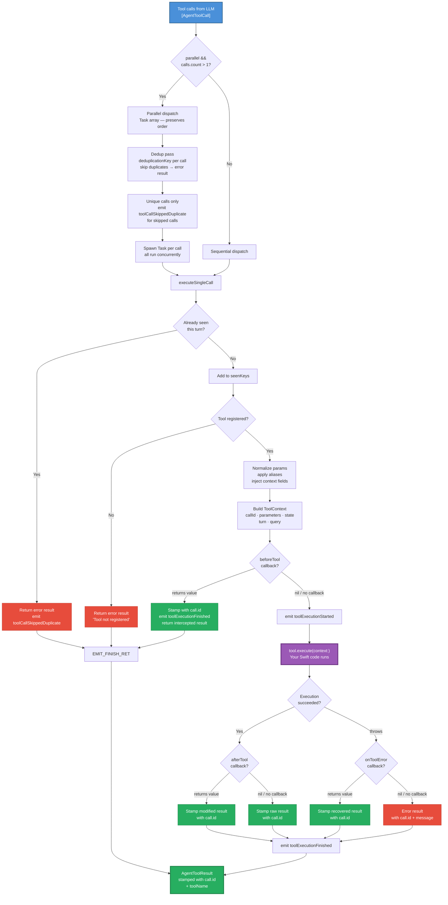
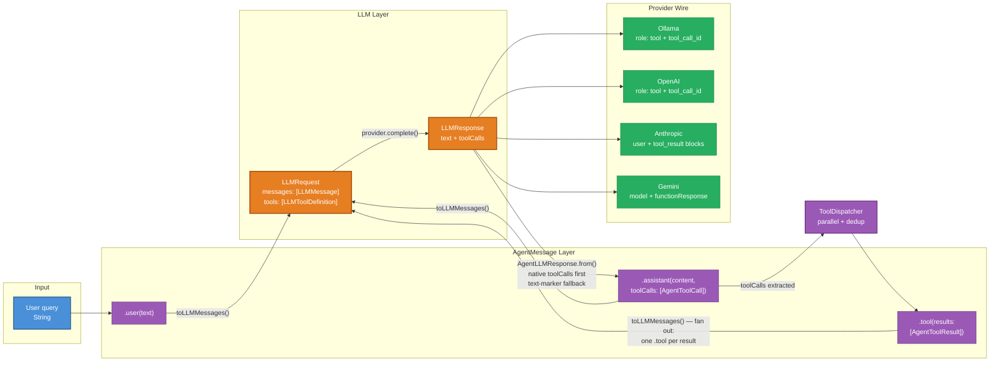

# Architecture

Detailed engineering diagrams for SwiftAgentKit's internals.

## Agent ReAct loop

The complete decision tree the agent follows on every `run()` call. **Follow the green path for the happy path** — blue is input, purple is SwiftAgentKit internals, orange is LLM calls, green is success, red is error handling:

```mermaid
flowchart TD
    START(("agent.run(query)"))
    START --> BEFORE_AGENT{"beforeAgent<br/>callback?"}
    BEFORE_AGENT -- "returns value" --> SHORT_CIRCUIT["Return intercepted<br/>response immediately"]
    BEFORE_AGENT -- "nil / no callback" --> ADD_USER["Append user message<br/>to conversation"]

    ADD_USER --> TOOLS["Get registered tools<br/>strengthen system prompt<br/>'You MUST use tools...'"]
    TOOLS --> SKILLS{"Query matches<br/>skill keywords?"}
    SKILLS -- "Yes" --> INJECT_SKILLS["Inject matching skill<br/>instructions into prompt"]
    SKILLS -- "No" --> PLAN_CHECK
    INJECT_SKILLS --> PLAN_CHECK{"Planning enabled?<br/>planner.shouldPlan()"}
    PLAN_CHECK -- "Yes" --> PLAN["Generate plan via LLM<br/>emit planGenerated<br/>add plan to conversation"]
    PLAN_CHECK -- "No" --> LOOP_ENTRY

    PLAN --> LOOP_ENTRY{{"Agent Loop — turn N"}}
    LOOP_ENTRY --> CANCEL{"Cancelled?"}
    CANCEL -- "Yes" --> CANCELLED["throw AgentError.cancelled"]
    CANCEL -- "No" --> TRIM["Get messages<br/>trim to context window<br/>emit historyTrimmed if needed"]

    TRIM --> LLM_START["emit llmCallStarted"]
    LLM_START --> BEFORE_MODEL{"beforeModel<br/>callback?"}
    BEFORE_MODEL -- "returns value" --> USE_INTERCEPT["Use intercepted response"]
    BEFORE_MODEL -- "nil / no callback" --> BUILD_REQ["Build LLMRequest<br/>state-templated system prompt<br/>+ tool definitions"]
    USE_INTERCEPT --> HAS_TOOLS_1

    BUILD_REQ --> CALL_LLM["provider.complete(request)"]
    CALL_LLM --> LLM_ERROR{"LLM call<br/>failed?"}
    LLM_ERROR -- "Yes" --> ON_MODEL_ERROR{"onModelError<br/>callback?"}
    ON_MODEL_ERROR -- "returns fallback" --> USE_FALLBACK["Use fallback response"]
    ON_MODEL_ERROR -- "nil / no callback" --> THROW_PROVIDER["throw AgentError.providerError"]
    USE_FALLBACK --> HAS_TOOLS_1{"Response has<br/>tool calls?"}
    LLM_ERROR -- "No" --> PARSE["AgentLLMResponse.from(response)<br/>native toolCalls first,<br/>text-marker fallback"]
    PARSE --> AFTER_MODEL{"afterModel<br/>callback?"}
    AFTER_MODEL -- "returns value" --> MODIFIED["Use modified response"]
    AFTER_MODEL -- "nil / no callback" --> HAS_TOOLS_1
    MODIFIED --> HAS_TOOLS_1

    HAS_TOOLS_1 -- "Yes — happy path" --> EMIT_TOOL_CALLS["emit toolCallsReceived<br/>append assistant msg<br/>with tool calls"]
    EMIT_TOOL_CALLS --> DISPATCH["ToolDispatcher.dispatch()<br/>parallel + dedup + callbacks<br/>stamp each result with call.id"]
    DISPATCH --> UPDATE_PLAN{"Plan active?"}
    UPDATE_PLAN -- "Yes" --> PROGRESS["Update plan step<br/>progress"]
    UPDATE_PLAN -- "No" --> APPEND_RESULTS
    PROGRESS --> APPEND_RESULTS["Append tool results<br/>to conversation<br/>trim history"]
    APPEND_RESULTS --> LOOP_BACK{{"Continue to next turn"}}
    LOOP_BACK --> LOOP_ENTRY

    HAS_TOOLS_1 -- "No" --> REPAIR_CHECK{"Repair-retry?<br/>errors exist &<br/>shouldRetry()"}
    REPAIR_CHECK -- "Yes" --> NUDGE_REPAIR["Append repair nudge<br/>emit repairRetryTriggered"]
    NUDGE_REPAIR --> LOOP_BACK
    REPAIR_CHECK -- "No" --> PLAN_CONT_CHECK{"Plan continuation?<br/>plan incomplete &<br/>shouldContinue()"}
    PLAN_CONT_CHECK -- "Yes" --> NUDGE_PLAN["Append continuation nudge<br/>emit planContinuationTriggered"]
    NUDGE_PLAN --> LOOP_BACK
    PLAN_CONT_CHECK -- "No — done!" --> DONE["Append assistant response<br/>emit finished(summary)<br/>clear temp state"]

    DONE --> AFTER_AGENT{"afterAgent<br/>callback?"}
    AFTER_AGENT -- "returns value" --> RETURN_MOD["Return modified<br/>response"]
    AFTER_AGENT -- "nil / no callback" --> RETURN["Return response"]

    LOOP_ENTRY -.-> |"maxTurns reached"| MAX_TURNS["emit finished(summary)<br/>throw AgentError.maxTurnsReached"]

    style START fill:#4A90D9,stroke:#2C5F8A,stroke-width:2px,color:#fff
    style ADD_USER fill:#9B59B6,stroke:#6C3483,stroke-width:1px,color:#fff
    style TOOLS fill:#9B59B6,stroke:#6C3483,stroke-width:1px,color:#fff
    style INJECT_SKILLS fill:#9B59B6,stroke:#6C3483,stroke-width:1px,color:#fff
    style PLAN fill:#9B59B6,stroke:#6C3483,stroke-width:1px,color:#fff
    style BUILD_REQ fill:#E67E22,stroke:#A04500,stroke-width:1px,color:#fff
    style CALL_LLM fill:#E67E22,stroke:#A04500,stroke-width:1px,color:#fff
    style PARSE fill:#E67E22,stroke:#A04500,stroke-width:1px,color:#fff
    style DISPATCH fill:#9B59B6,stroke:#6C3483,stroke-width:2px,color:#fff
    style APPEND_RESULTS fill:#9B59B6,stroke:#6C3483,stroke-width:1px,color:#fff
    style DONE fill:#27AE60,stroke:#1E8449,stroke-width:3px,color:#fff
    style RETURN fill:#27AE60,stroke:#1E8449,stroke-width:2px,color:#fff
    style RETURN_MOD fill:#27AE60,stroke:#1E8449,stroke-width:2px,color:#fff
    style SHORT_CIRCUIT fill:#95A5A6,stroke:#7F8C8D,stroke-width:1px,color:#fff
    style CANCELLED fill:#E74C3C,stroke:#C0392B,stroke-width:1px,color:#fff
    style THROW_PROVIDER fill:#E74C3C,stroke:#C0392B,stroke-width:1px,color:#fff
    style MAX_TURNS fill:#E74C3C,stroke:#C0392B,stroke-width:1px,color:#fff
    style NUDGE_REPAIR fill:#E67E22,stroke:#A04500,stroke-width:1px,color:#fff
    style NUDGE_PLAN fill:#E67E22,stroke:#A04500,stroke-width:1px,color:#fff
```

## Tool dispatch pipeline

Every tool call goes through this pipeline — dedup, lookup, callbacks, execution, and ID stamping:

> **ID stamping** is critical for strict providers (OpenAI, Anthropic). Every result — whether from normal execution, callback interception, or error recovery — is stamped with the original `AgentToolCall.id` before entering conversation memory. Without this, providers reject or mis-correlate tool results.

## Message flow

How messages transform through the system — from user query to tool results and back:

> **Fan-out**: A single `.tool(results: [r1, r2, r3])` agent message fans out to **three** separate `LLMMessage.tool(content:toolCallId:)` messages — one per result, each carrying its own `toolCallId`. Collapsing them under one ID breaks strict providers.